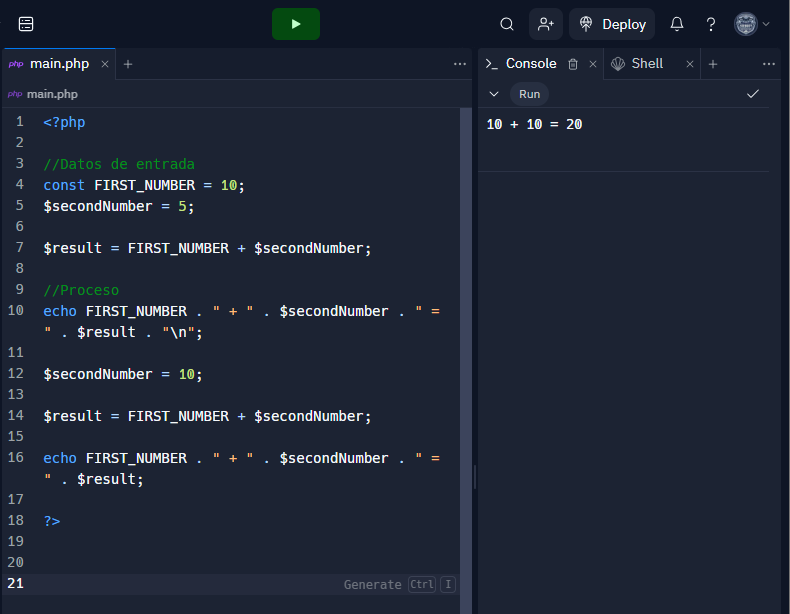
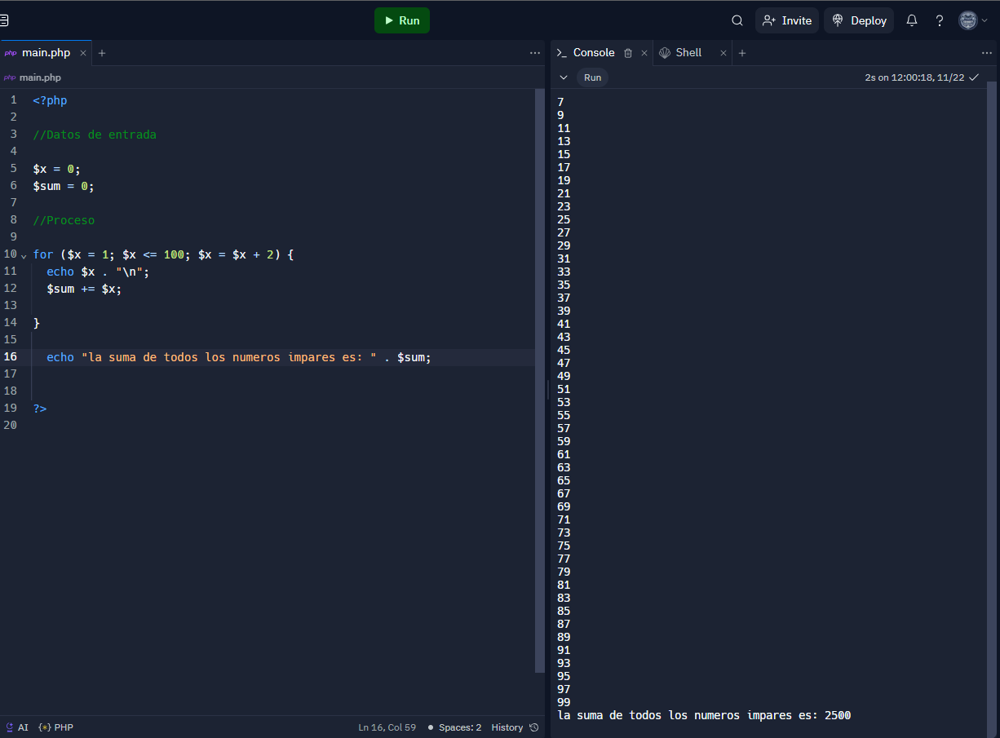

<h1>Taller 10 - Rafael Ricardo Pinzon Mayorga</1>

<h2>Informacion</h2>

Curso: Full stack Basico - grupo 1

Profesor: Cristian Patiño

<h2>Punto 1: Constantes y Variables</h2>

<h2>Punto 2: Sumas de constantes y variables </h2>

<h2>Punto 3: Sumas de dos numeros indicados por el usuario</h2>

<h2>Punto 4: Datos del usuario en pantalla</h2>

<h2>Punto 5: Entrada de bolera usando if /else</h2>

<h2>Punto 6: Deteccion de mayoria de edad</h2>

<h2>Punto 7: Seleccion de operacion aritmetica</h2>

<h2>Punto 8: Entrada de bolera usando Switch </h2>

<h2>Punto 9: Tabla de multiplicar usando while</h2>

<h2>Punto 10: Numeros pares usando while</h2>

<h2>Punto 11: Numeros impares usando for</h2>

<h2>Punto 12: Tabla de multiplicar usando for </h2>

<h2>Punto 13: Suma de valores de un arreglo usando foreach</h2>

<h2>Punto 14: Revision de contraseña</h2>

<h2>Punto 15: Selecion de operacion arintmetica usando funciones</h2>